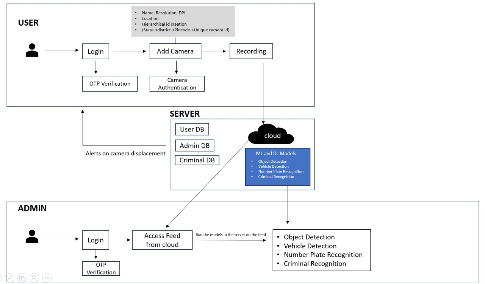

# Centralized Camera Location and Surveillance System

## Introduction

This application serves as a robust centralized surveillance system designed to manage and monitor CCTV cameras efficiently. The system employs a server infrastructure to receive, process, and analyze live camera feeds and store into the cloud. As per needs, using advanced AI techniques we can have special surveillance features to be able to identify number plates OCR, tagged vehicles, or even to detect potential threats. Geo-tagging of each camera is based on latitude and longitude facilitates location tracking, and a map visualization enhances the overall coverage overview. The special ID of the camera is a combination of pincode and an hashed ID which helps us to reduce the searching feeds of a particular area.

## Key Features

### Centralized Server Infrastructure

- Manages the reception and processing of live camera feeds.
- Helps the feeds to get stored into the cloud.
- Utilizes computer vision techniques to analyze video streams.
- Extracts essential metadata, such as location and status, for each camera via a mongodb database.
- Handles requests remotely via devices to be saved in the server.

### Hierarchical Unique ID System

- Assigns a unique identifier to each camera.
- Implements a hierarchical structure for efficient camera identification - State → District → Locality → Area → Unique ID(Subject to change as per live location).

### Geo-tagging

- Tags cameras with latitude and longitude information, basic address and its ID.
- Enables visualization of camera locations on an interactive map.

### User Registration and Camera Authentication

- Requires user registration for system access.
- Implements secure authentication using Gauth.
- Associates cameras with owners' accounts for personalized access.

### ML Models and Facial Recognition

- Integrates YOLOv8 object detection model for vehicle color, type and number plate recognition.
- Utilizes facial recognition to identify unauthorized individuals.
- Displays bounding boxes and capture frames after fetching streams from the cloud and store the tagged info separately so it saves time.

### Alerting Mechanisms via MQTT

- Sends alerts to local authorities upon detecting threats.
- Utilizes MQTT for efficient and real-time alert dissemination.

## Architecture

### Server Infrastructure

- Receives and processes live camera feeds.
- Extracts metadata, including location and status, for each camera.
- Interfaces for camera registration, authentication, and health monitoring.
- Integration with ML models for object and facial detection.
- Handles feed to be directly captured and stored into the cloud.
- Handles fetching locations from remote devices.
  
### Camera Metadata

- Maintains a comprehensive database for each camera.
- Includes hierarchical location ID, owner information, health status, and more.
- Streaming resolution configuration for optimal video quality.

### Map Visualization

- Visualizes all cameras on an interactive map for each district.
- Facilitates a comprehensive overview of the surveillance area.
- Aids in identifying potential blind spots.

### User Authentication

- Requires user registration with verification documents.
- Cameras are securely assigned to owners' accounts.
- Implements Kerberos for secure and reliable authentication.

The design on the app can be seen [here](https://www.figma.com/file/DEhKfePscqCpsP7Lpx2yj4/security-(Community)?type=design&node-id=0%3A1&mode=design&t=M0ETGKfWs7FWqsRv-1).
